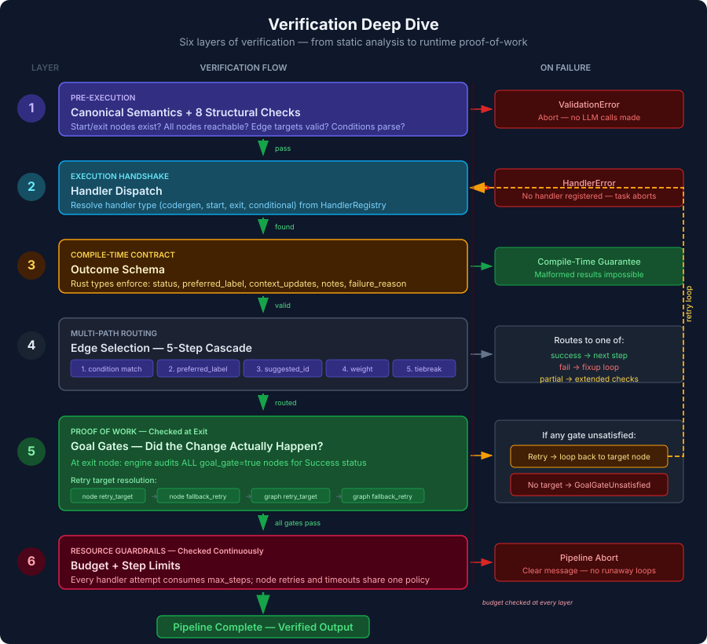
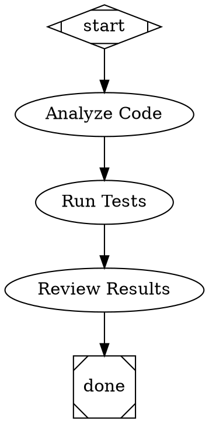

# PAS — Pascal's Discrete Attractor

A DOT-based pipeline runner for AI workflows. Define multi-step agent pipelines as Graphviz digraphs, then run them with built-in tool use, multi-provider LLM support, and checkpoint/resume.

These loops don't just handle failure — they create iterative refinement. A pipeline can produce progressively better output across multiple passes without any single component knowing about "quality improvement." The retry system handles transient failures, context accumulation builds knowledge, and goal gates enforce standards. Together they produce convergent behavior toward a quality threshold that no individual loop implements.

<p align="center">
  
</p>

### How verification works

PAS doesn't just run tasks — it verifies them. Six layers of checks ensure that every pipeline node actually did what it was supposed to do, from static analysis before any LLM call to runtime proof-of-work at the exit gate.

<p align="center">
  
</p>

1. **Static Validation** — Canonical semantic compilation plus nine structural checks run before any LLM call. Missing start nodes, unavailable handlers, unknown providers, unreachable steps, and malformed conditions are caught immediately.
2. **Handler Dispatch** — The compiler resolves each node's handler type and provider once; the engine dispatches that typed plan and aborts before execution if a required handler isn't registered.
3. **Outcome Schema** — Rust's type system enforces the response contract at compile time. Every handler must return a status, context updates, and notes — malformed results are structurally impossible.
4. **Edge Routing** — A 5-step cascade selects the next edge: condition match → preferred label → suggested ID → weight → lexical tiebreak. This enables patterns like "pass → deploy, partial → extended tests, fail → fixup loop."
5. **Goal Gates** — The "proof of work" layer. Nodes marked `goal_gate=true` are audited at exit. If any gate is unsatisfied, the engine resolves a retry target (node → fallback → graph-level) and loops back. No target found means pipeline abort.
6. **Budget & Step Guards** — `max_steps`, `max_budget_usd`, and `max_retries` are enforced continuously. Runaway loops are impossible.

Run controls are immutable typed configuration, separate from workflow `Context` data.
DOT attributes, handler outputs, and resumed checkpoints cannot replace caller
limits, dry-run mode, the working directory, or Claude isolation settings.

For the full specification including code references and examples, see **[docs/task-verification.md](docs/task-verification.md)**.

## Overview

PAS lets you describe AI workflows as directed graphs using DOT syntax. Each node is a step (LLM call, tool use, or human gate) and edges define the flow with optional conditions. The engine handles execution, edge selection, retries, goal enforcement, and cost tracking.

PAS rejects multi-edge `component` fan-out and every fan-in node during semantic compilation. A `component` node with at most one outgoing edge remains available as sequential compatibility. True fork/join execution is not supported yet.



## Codergen Provider Integration

PAS's `codergen` handler executes pipeline nodes through the explicitly selected local Claude Code, Codex, or Gemini CLI. A Claude-backed node can use your existing Claude subscription with no separate API key.

Each `codergen` node invokes the explicitly selected provider binary. The handler
normalizes Claude Code, Codex, and Gemini output into one outcome and feeds that
context forward to downstream nodes. Dollar cost and turn counts are recorded
when the selected CLI reports them.

### Node attributes for codergen nodes

| Attribute | Description |
|-----------|-------------|
| `prompt` | Optional task prompt sent to the selected provider; validation warns when both it and a descriptive label are absent |
| `llm_provider` (required) | `"claude"`, `"codex"`, or `"gemini"` for provider-backed nodes |
| `llm_model` | Model override (e.g. `"sonnet"`, `"haiku"`, `"opus"`) |
| `allowed_tools` | Comma-separated list of tools Claude Code may use |
| `max_budget_usd` | Spending cap for this node |

Prompted conditional nodes (`shape=diamond`) ask the selected provider to choose
an outgoing edge label. By default, a diamond without a prompt is a pass-through
conditional and starts no provider process. Setting `type="codergen"` explicitly
is the exception: it makes the diamond provider-backed even without a prompt and
therefore requires `llm_provider`.

For nodes that only need a single LLM completion without tool use, PAS also provides direct API handlers for OpenAI, Anthropic, and Gemini via the `attractor-llm` crate.

## Features

- **Explicit local provider execution** -- Each `codergen` node selects the local Claude Code, Codex, or Gemini CLI it runs
- **DOT pipeline definitions** -- Standard Graphviz digraph syntax with typed attributes (strings, integers, floats, booleans, durations)
- **Direct pipeline generation** -- Pass a PRD and/or spec file to generate a self-contained .dot pipeline (no external issue tracker required)
- **End-to-end launch** -- `pas launch <docs/>` discovers spec+PRD pairs, generates pipelines, validates, and runs them sequentially in one command
- **Planning workflow** -- Generate PRD and spec documents from templates or AI prompts, decompose specs into beads issues, scaffold pipelines from epics
- **Beads integration** -- Decompose specs into epics and tasks, scaffold pipelines from beads epics, close issues as pipeline nodes complete
- **Multi-provider LLM support** -- OpenAI, Anthropic, and Gemini adapters with unified request/response types
- **Built-in tools** -- read_file, write_file, edit_file, shell, grep, glob
- **Agent loop** -- LLM + tool execution cycle with steering injection, follow-up queues, loop detection, and output truncation
- **Pipeline engine** -- Sequential graph traversal, edge selection, condition evaluation, and manager loops
- **Human review gates** -- Pause pipeline execution for human approval at any step
- **Goal gates** -- Enforce completion criteria before allowing pipeline exit
- **Checkpoint/resume** -- Save and restore pipeline state mid-execution
- **Validation** -- Canonical semantic compilation plus nine structural checks
- **Stylesheets** -- CSS-like rules for applying attributes to nodes by selector
- **Variable transforms** -- Variable transforms expand `${key}` references in node prompts from graph-level attributes
- **Retry with backoff** -- Configurable retry policies for node execution
- **Cost tracking** -- Per-node and total USD cost reporting

## Installation

```sh
./install.sh
```

This builds a release binary and installs it to `~/.local/bin/pas`.

Or install via cargo:

```sh
cargo install --path crates/attractor-cli
```

## Usage

### Run a pipeline

```sh
pas run pipeline.dot --workdir ./my-project
```

### Validate a pipeline

```sh
pas validate pipeline.dot
```

### Inspect a pipeline

```sh
pas info pipeline.dot
```

### Dry run (no LLM calls)

```sh
pas run pipeline.dot --dry-run
```

### Launch end-to-end from a docs directory

```sh
pas launch docs/implementation/ -w .
```

Discovers all `*-spec.md` files in the directory, pairs each with a `*-prd.md` if present, generates `.dot` pipelines, validates them all, then runs them sequentially. Use zero-padded prefixes to control order (`phase-01-spec.md`, `phase-02-spec.md`).

### Generate a pipeline from a spec (no beads)

```sh
# Spec only
pas generate spec.md

# PRD + spec (positional)
pas generate prd.md spec.md

# PRD + spec (named flags)
pas generate --prd prd.md --spec spec.md

# Custom output path
pas generate spec.md -o pipelines/my-feature.dot
```

### Planning workflow (PRD → Spec → Beads → Pipeline)

```sh
# Generate a PRD from a prompt
pas plan --prd --from-prompt "Add user authentication with OAuth2"

# Or copy the blank template and edit manually
pas plan --spec

# Decompose a spec into beads epic + tasks
pas decompose .pas/spec.md

# Scaffold a pipeline from the beads epic
pas scaffold <EPIC_ID>

# Run the generated pipeline
pas run pipelines/<EPIC_ID>.dot -w .
```

There's also a meta-pipeline that chains the full workflow end-to-end:

```sh
pas run templates/plan-to-execute.dot -w .
```

## Documentation

- **[docs/cli-reference.md](docs/cli-reference.md)** — CLI commands, flags, examples, and environment setup
- **[docs/task-verification.md](docs/task-verification.md)** — How pipeline nodes are verified: handler dispatch, outcome schemas, goal gates, edge routing, and budget guards
- **[docs/guide.md](docs/guide.md)** — Full user guide covering:

- DOT file syntax and all node/edge attributes
- Conditional routing, goal gates, and stylesheets
- Pipeline patterns (linear, verify/fixup loop, branching, feature implementation)
- Planning workflow (PRD → spec → beads → pipeline)
- Beads integration for issue-driven development
- Writing effective prompts and controlling costs
- Adding PAS to your project

## Environment Variables

There is no implicit runtime provider. Every node whose resolved handler consumes a provider must
select `claude`, `codex`, or `gemini` with `llm_provider`. Claude-backed nodes
use your local Claude Code installation and can run on your Claude subscription
without a separate API key; Codex- and Gemini-backed nodes use their respective
local CLI authentication.

For direct API calls via the `attractor-llm` crate (OpenAI, Anthropic, or Gemini handlers), set the relevant keys:

```sh
export OPENAI_API_KEY=...
export ANTHROPIC_API_KEY=...
export GEMINI_API_KEY=...
```

## Crate Structure

| Crate | Description |
|-------|-------------|
| `attractor-types` | Shared error types and context |
| `attractor-dot` | DOT parser producing typed AST |
| `attractor-llm` | Unified LLM client (OpenAI, Anthropic, Gemini) |
| `attractor-tools` | Tool trait, registry, built-in tools, execution environment |
| `attractor-agent` | Agent session loop with steering and loop detection |
| `attractor-pipeline` | Pipeline graph, engine, handlers, validation, stylesheets |
| `attractor-cli` | CLI binary — `pas` (`run`, `validate`, `info`, `plan`, `decompose`, `scaffold`, `generate`, `launch`) |
| `attractor-web` | Web interface (Leptos) |

## Reference

Built with reference to [strongdm/attractor](https://github.com/strongdm/attractor).

## License

Licensed under either of

- Apache License, Version 2.0 ([LICENSE-APACHE](LICENSE-APACHE) or <http://www.apache.org/licenses/LICENSE-2.0>)
- MIT License ([LICENSE-MIT](LICENSE-MIT) or <http://opensource.org/licenses/MIT>)

at your option.

### Contribution

Unless you explicitly state otherwise, any contribution intentionally submitted for inclusion in the work by you, as defined in the Apache-2.0 license, shall be dual licensed as above, without any additional terms or conditions.
