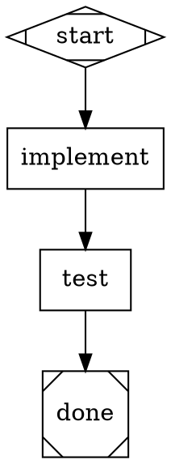

# Task Verification in PAS

How PAS verifies that pipeline nodes (agent tasks) actually completed — and completed correctly. Verification is layered, moving from basic execution checks to deep logic validation.

---

## 1. Execution Handshake (Handler Dispatch)

The first layer binds compiled semantics to the available handlers, then verifies
the transport-level execution handshake. When the engine dispatches a task to a
bound handler, it expects a well-formed `Outcome` response.

- **Plan Binding:** Before execution, PAS verifies that every handler required by the compiled plan is registered and still declares the provider capability used at compilation. An unavailable handler or changed provider capability is a `ValidationError` before any handler runs.
- **Handler Execution:** After successful plan binding, a handler execution failure is a `HandlerError`; handler identity is not re-derived from node attributes during dispatch.
- **Typed Provider Handlers:** A provider-consuming custom handler exposes a `ProviderNodeHandler` through `NodeHandler::provider_handler`. Provider capability is derived from that typed executor, whose required method receives the normalized `ResolvedNode`; it cannot opt in to provider use while inheriting raw-node dispatch.
- **Timeout / Budget Guards:** The engine enforces `max_steps` and `max_budget_usd` limits. If a node hangs or the pipeline enters a runaway loop, it aborts with a clear error rather than running forever.
- **Failure on No Response:** If a handler returns `StageStatus::Fail` and there is no outgoing edge to handle the failure, the pipeline terminates with a `HandlerError`.

**Relevant code:** `crates/attractor-pipeline/src/execution_plan.rs` —
`ensure_registry_compatible()`; `crates/attractor-pipeline/src/engine.rs` — plan
entry checks and the main execution loop.

---

## 2. Output Schema (Outcome Structure)

Every handler must return an `Outcome` struct. The type system enforces the contract at compile time:

| Field | Type | Purpose |
|-------|------|---------|
| `status` | `StageStatus` | `Success`, `Fail`, `PartialSuccess`, `Retry`, `Skipped` |
| `preferred_label` | `Option<String>` | Hint for edge selection (conditional routing) |
| `suggested_next_ids` | `Vec<String>` | Ordered preference for next node |
| `context_updates` | `HashMap<String, Value>` | Key-value pairs merged into pipeline context |
| `notes` | `String` | Human-readable summary of what happened |
| `failure_reason` | `Option<String>` | Explanation when status is `Fail` |

- **Structure enforcement:** Rust's type system guarantees every handler returns all required fields. There is no "malformed result" at runtime — the compiler catches it.
- **Data integrity:** Context updates use `serde_json::Value`, so type mismatches (e.g., string where a number is expected) surface when downstream nodes consume them via typed accessors.
- **Status propagation:** The engine writes `outcome` to the pipeline context after each node, making the result available to edge conditions.

**Relevant code:** `crates/attractor-types/src/lib.rs` — `Outcome` and `StageStatus` definitions.

---

## 3. Functional Logic Verification (Goal Gates)

This is the "proof of work" layer. The pipeline doesn't just trust that a node succeeded — goal gates enforce that **the intended change actually happened**.

### How it works

1. Mark critical nodes with `goal_gate=true` in the DOT definition.
2. When the pipeline reaches the canonical exit node recorded by `ExecutionPlan`, the engine checks **all** goal gate nodes. Exit nodes may use canonical `shape="Msquare"`, explicit `type="exit"`, or a compatible magic-ID form; compilation resolves these forms before execution.
3. If any goal gate node's outcome is not `Success`, the pipeline either retries or fails.

### Retry resolution order

When a goal gate fails, the engine looks for a retry target in this order:

1. **Node `retry_target`** — the failing node's own attribute
2. **Node `fallback_retry_target`** — the node's fallback
3. **Graph `retry_target`** — graph-level default
4. **Graph `fallback_retry_target`** — graph-level fallback
5. **No target found** → `GoalGateUnsatisfied` error (pipeline aborts)

### Example



If `test` fails, the pipeline loops back to `implement`. On the next pass, `implement` gets the failure context and can fix the code. The cycle continues until tests pass or `max_retries` / `max_steps` is hit.

**Relevant code:** `crates/attractor-pipeline/src/goal_gate.rs` — `enforce_goal_gates()`.

---

## 4. Conditional Edge Routing (Multi-Path Validation)

Instead of binary pass/fail, PAS supports **condition-based routing** that lets the pipeline take different verification paths based on node outcomes or context values.

### Edge conditions

```dot
check -> fix_path   [condition="outcome=fail"]
check -> next_step  [condition="outcome=success"]
check -> review     [condition="outcome=partial_success"]
```

Conditions can reference:
- `outcome` — the node's execution status
- `preferred_label` — the node's suggested edge label
- Any key in the pipeline context (e.g., `deploy_env=prod`)

### Edge selection algorithm

1. Check edges with matching conditions first
2. Fall back to `preferred_label` match
3. Fall back to `suggested_next_ids` from the handler
4. Fall back to `default=true` edge
5. Fall back to the single unconditional edge (if only one exists)

This enables verification patterns like "if tests pass, deploy; if tests partially pass, run extended tests; if tests fail, loop back to fix."

**Relevant code:** `crates/attractor-pipeline/src/edge_selection.rs` — `select_edge()`.

---

## 5. State Observation (Context & Checkpoint)

The pipeline uses an immutable typed `RunConfiguration` for execution policy and
a shared `Context` (an async key-value store) for workflow data.

### Status progression

As each node executes, typed engine state and workflow Context have distinct roles:

- **Before execution:** Node is the `current_node` in the engine loop
- **After execution:** `Outcome` is recorded in `node_outcomes`; validated workflow updates are applied to Context
- **At exit:** `enforce_goal_gates()` audits all gate nodes before allowing completion

### Checkpoint/resume

Workflow and traversal state can be serialized mid-execution and restored later, enabling:
- Long-running pipelines that survive process restarts
- Human review gates that pause for approval
- Debugging failed pipelines from the point of failure

Run controls are never restored from Context. Legacy checkpoint keys matching
`dry_run`, limits, workdir, provider isolation, or internal routing names are
filtered, so the current `RunConfiguration` remains authoritative.

### Cost tracking

Each node's `cost_usd` workflow update is accumulated against the typed global
budget. The engine logs per-node and running totals and aborts if the budget is
exceeded. The budget value itself is not stored in Context.

**Relevant code:** `crates/attractor-pipeline/src/run_configuration.rs` and
`crates/attractor-types/src/context.rs`.

---

## 6. Static Validation (Lint Rules)

Before any execution begins, the pipeline compiles canonical node, handler, and
provider semantics and then applies nine structural checks:

| Rule | Severity | What it checks |
|------|----------|----------------|
| Semantic compilation | Error | String-typed semantic attributes; exactly one start and exit; compatible roles and aliases; known handlers/providers; provider present for provider-consuming handlers |
| Reachability | Error | All nodes are reachable from start |
| Edge targets exist | Error | No edges pointing to undefined nodes |
| Start/exit edge direction | Error | Start has no incoming edges and exit has no outgoing edges |
| Condition syntax | Error | Edge conditions are well-formed |
| Goal gate has retry | Warning | Goal gate nodes have a retry target defined |
| Retry targets exist | Warning | Named retry and fallback targets exist |
| Prompt presence | Warning | `codergen` nodes have a prompt or descriptive label |
| Fidelity values | Warning | Context fidelity attributes use valid prefixes |

The load path is parse → **compile semantics** → **validate structure** →
initialize → execute → finalize. Errors abort before any LLM calls are made.

**Relevant code:** `crates/attractor-pipeline/src/validation.rs` — `validate()` and `validate_or_raise()`.

---

## Summary: Verification Layers

| Layer | What is Checked | Failure Result |
|-------|----------------|----------------|
| **Semantic Compilation** | Roles, handler capability, and provider valid? | `ValidationError` before execution |
| **Static Validation** | Pipeline structure correct? | `ValidationError` before execution |
| **Plan Binding** | Required handlers are registered with unchanged provider capabilities? | `ValidationError` before execution |
| **Handler Dispatch** | Bound handler executes successfully? | `HandlerError`, task abort |
| **Outcome Schema** | Output has required fields? | Compile-time error (Rust types) |
| **Edge Routing** | Status matches a route? | Pipeline terminates or errors |
| **Goal Gates** | Did the intended change happen? | Retry loop or `GoalGateUnsatisfied` |
| **Budget/Step Guards** | Within resource limits? | Pipeline abort with clear message |
